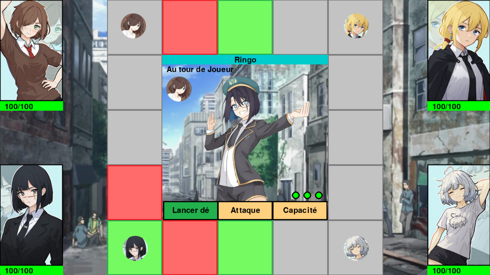
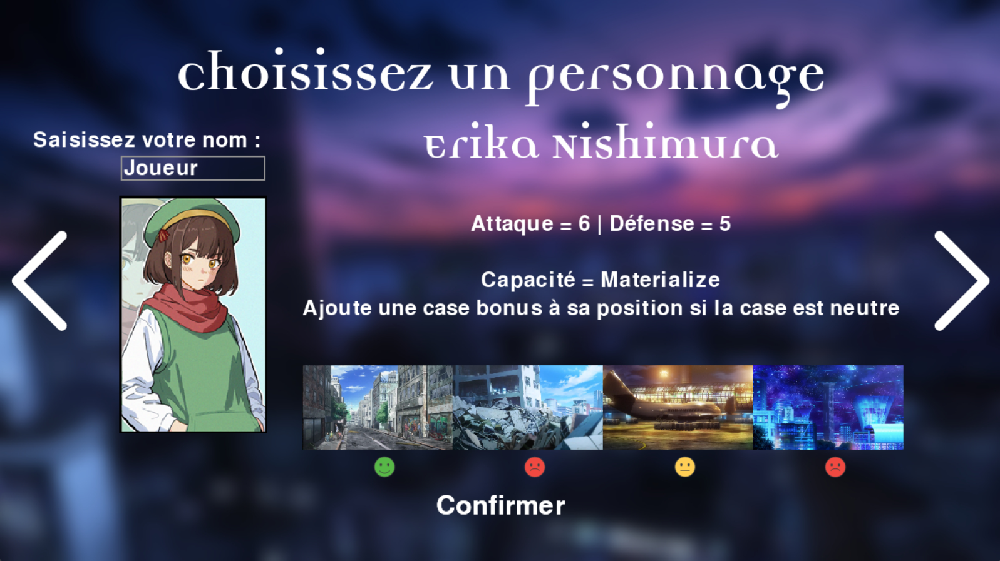
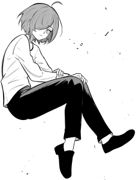
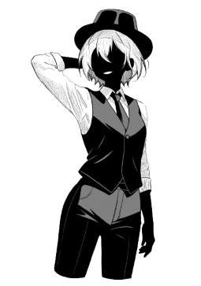
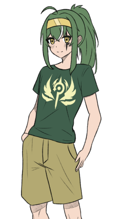

# **La Cité Académique**

## **Présentation**
> Le jeu se déroule dans l’univers de la série “A Certain Scientific Railgun”.

Bienvenue dans la Cité Académique, une ville entièrement dédiée aux études et à la recherche, isolée du reste du monde et bénéficiant d'une avance technologique d'environ 30 ans par rapport aux autres nations.

Ici, 90 % des résidents sont des étudiants participant à un programme de développement de pouvoirs psychiques. Ces pouvoirs, qui varient d'un individu à l'autre, possèdent des degrés de puissance divers. Ils sont classés selon une échelle allant de 1 à 5, mais certaines personnes ont des capacités si faibles qu'elles sont considérées comme de niveau 0.

La ville est régulièrement la cible d'attaques de mages venus de l'extérieur, déterminés à freiner l'essor de ces pouvoirs scientifiques, qui deviennent de plus en plus redoutables. Votre mission est de repousser ces assaillants pour maintenir la paix dans cette cité futuriste.

## **Règles**

Le jeu peut se jouer de **1 à 4 joueurs**, avec des ordinateurs ajoutés automatiquement pour compléter jusqu'à 4 participants. Chaque joueurs doit choissir un personnage, et un personnage ne peux **pas être** choisi par 2 joueurs différents. Les ordinateurs reçoivent un personnage par défaut, mais celui-ci peut être **modifié**. L'objectif du jeu est simple : **vaincre** tous les ennemis pour gagner.


  
### Déroulement d'une partie

> Le jeu se déroule uniquement avec la souris, tout action sera effectué en cliquant sur les boutons du jeu ou cases du plateau.
> Appuyez sur 'echap' pour mettre le jeu en pause.
> Les boutons du jeu permettant une action seront affiché en vert. Ils deviennent bleu si ils sont en attente d'une action supplémentaire. Si ils sont oranges on ne peut pas cliquer dessus.


Le jeu se déroule en 4 manches, chaque manches représentent un ennemi à affronter dans un lieu différent. Une manche se termine lorsque l'ennemi est vaincu. Le jeu se joue en tour par tour, chaques joueurs lancent un dé à 6 faces et peuvent choisir d'avancer d'un nombre de cases compris entre 1 et le résultat obtenu sur le dé. Une fois déplacé, un joueur peut choisir entre attaquer l'ennemi en cours ou utiliser la capacité du personnage qu'il possède. Lorsque les personnages ont tous joués, l'ennemi actuel lance une attaque et le jeu passe au tour suivant. Si le personnage d'un joueur n'a plus de vie, il ne joue pas. La partie se termine quand les joueurs réussissent à vaincre les 4 ennemis, ou que tous les personnages sont éliminés.  


### Spécificités de jeu

#### Effets du plateau

Le plateau de jeu comporte **trois types de cases**:


| Case                              | Effet                                               |
|------------------------------------|----------------------------------------------------------|
|  | Les cases **neutres**: <br> Ce sont les cases basiques, elles n'ont **aucun effet**. |
|     | Les cases **bonus**: <br> Ajoute un bonus sur **l'attaque**, la **défense** et la **capacité** des personnages présents. |
|     | Les cases **malus**: <br> Ajoute un malus sur **l'attaque**, la **défense** et la **capacité** des personnages présents. |




#### Effets des lieux

Chaque personnage possède des affinités spécifiques avec certains lieux, ce qui est affiché lors de la sélection des personnages. Ces affinités augmentent leur attaque et leurs capacités, rendant certains personnages plus puissants selon le lieu dans lequel ils se trouvent.

  

  


## **Personnages**
> Les personnages sont représenté sur le plateau par une icône les représentant.

### Aurore Thercieux


 
**100** PV  
**10** Attaque  
**6** Défense    

**Capacité:**

- Nom: **Railgun**  
- Type: **Attaque**  
- Description: Lance une **puissante décharge électrique** à l'ennemi  
- Temps de rechargement: **3**  

Électromaster de niveau 4, elle a la capacité de lancer une grosse décharge électrique à l'ennemi. Elle a perdu la vision de son œil droit, ce qui l'empêche d'atteindre le niveau 5. Elle a tendance à détruire involontairement des bâtiments en s'entraînant dans le but de surpasser une certaine "Railgun" de niveau 5.


### Akane Kagari


**100** PV  
**5** Attaque  
**7** Défense  

**Capacité:**  

- Nom: **Offense Armor**  
- Type: **Défense**  
- Description: Bloque la **prochaine** attaque subit  
- Temps de rechargement: **1**  

Agile et robuste, elle a un pouvoir inconnu de la base de données. Elle a la capacité de réduire les dégats du prochain coup subit. Elle est connue pour être une menace dans les ruelles dangereuses, personne ne veut la croiser.


### Laura Occideum


**100** PV  
**5** Attaque  
**6** Défense

**Capacité:**  

- Nom: **Healing Touch**
- Type: **Support**
- Description: Soigne un personnage choisi à **30% des PV max**
- Temps de rechargement: **3**

Étudiante prometteuse et spécialiste de la sécurité, elle prodigue des soins dans les lieux publics.


### Bob 'bob'


**100** PV  
**3** Attaque  
**8** Défense

**Capacité:**  

- Nom: **Accelerator**
- Type: **Défense**
- Description: Renvoie une **partie des dégâts reçu** à l'ennemis
- Temps de rechargement: _Capacité passive_

Souvent comparée à un certain "Numéro 1" de la cité, elle a un pouvoir de niveau 4 qui lui permet de renvoyer tout ce qui la touche à son envoyeur. Elle n'arrive cependant pas à bloquer les coups après les avoir renvoyés. Elle possède une faible force à cause de son pouvoir.

**_Personnages à venir. . ._**

## **Ennemis**

> Les attaques des ennemis ne touchent pas un seul personnage mais la case ou celui-ci se trouve.

### Ringo

|  | - 300 PV <br> - 10 Attaque <br> - 10 Défense <br><br> Attaque un personnage au hasard. |
|-------|----------------------------------------------------------------------|

### Aurore's doppelganger

|  | - 325 PV <br> - 10 Attaque <br> - 10 Défense <br><br> Attaque un personnage au hasard, puis 5 cases du plateau. |
|-------|----------------------------------------------------------------------|

### Lucifer

|  | - 350 PV <br> - 10 Attaque <br> - 10 Défense <br><br> Attaque un personnage au hasard, puis les cases à côté du personnages. |
|-------|----------------------------------------------------------------------|

### "Fake god" Medato Amadeus

|  | - 400 PV <br> - 10 Attaque <br> - 10 Défense <br><br> Attaque un personnage au hasard, puis tout les autres personnages reçoivent une partie des dégâts initial. |
|-------|----------------------------------------------------------------------|


## **Lancement du jeu**

### Avec le fichier .exe

Se rendre dans le dossier _"La Cite Academique"_ et double cliquer sur le fichier _"La Cite Academique.exe"_ 

### Avec le fichier source

Se rendre dans le dossier _"cite_academique"_ et exécutez le fichier _"main.py"_

> Si le lancement affiche l'erreur: ```No module named pygame```

> Executez la commande suivante sur un terminal, puis réexécutez le fichier: ```pip install pygame```

## **Crédits**

- Fond du menu et des lieux : Images de la série
- Personnages : @MedatoAmadeus
